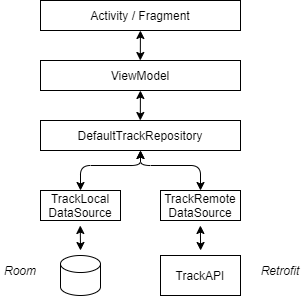

# MyAlbum
MyAlbum is a small demo application based on MVVM architecture pattern and using common Android Application tech-stach.
Application uses the library Dagger-Hilt for dependency injection.
Fetched data from the network are persisted into a database via repository pattern.

### Android Architecture Blueprint
Architecture is strongly inspired from [android architecture blueprint](https://github.com/android/architecture-samples/tree/dev-hilt) based on [Hilt](https://developer.android.com/training/dependency-injection/hilt-android) for dependency Injection.
I advice you to take a look to architectures described in the github repository.

### Tech stack & Open-source libraries
- Minimum SDK level 19
- [Kotlin](https://kotlinlang.org/) based, [Coroutines](https://github.com/Kotlin/kotlinx.coroutines)
- [Hilt](https://developer.android.com/training/dependency-injection/hilt-android) (alpha) for dependency injection.
- [JetPack](https://developer.android.com/jetpack)
  - LiveData - notify domain layer data to views.
  - Lifecycle - dispose of observing data when lifecycle state changes.
  - ViewModel - UI related data holder, lifecycle aware.
  - Room Persistence - construct a database using the abstract layer.
- Architecture
  - MVVM Architecture (View - DataBinding - ViewModel - Model)
  - Repository pattern
- [Retrofit2 & OkHttp3](https://github.com/square/retrofit) - construct the REST APIs and paging network data.
- [Jackson](https://github.com/FasterXML/jackson-core) - JSON library
- [Timber](https://github.com/JakeWharton/timber) - logging.
- [Material-Components](https://github.com/material-components/material-components-android) - Material design components like cardView.

### Architecture

### Hilt & Alpha version
Hilt is maybe cool however but it's still in alpha version. So it should not be bring in production before it enters in stable release.